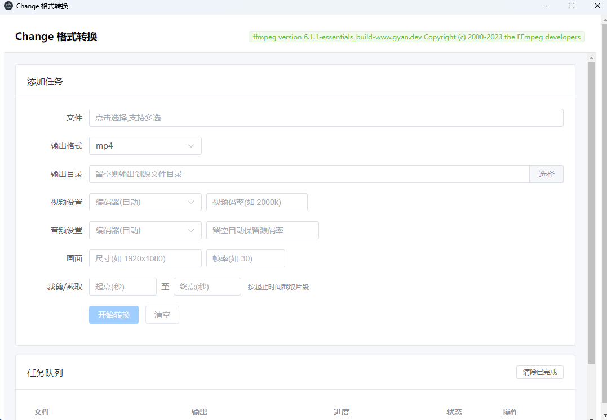

# Change

多媒体格式转换工具,旨在替代格式工厂。基于 FFmpeg,支持音视频、图片的格式互转、批量队列与进度显示。

[](https://github.com/mirexu/change/releases/latest)
[](https://github.com/mirexu/change/releases)
[](https://opensource.org/licenses/MIT)

> 本项目由 **DeepSeek** 构建。

## 📦 下载安装包

👉 [点此下载最新版本](https://github.com/mirexu/change/releases/latest)

支持 Windows、macOS、Linux 三平台。

## 📸 截图 / 演示



## 技术栈

| 层 | 技术 |
|---|---|
| 桌面框架 | Electron 31 |
| 构建 | electron-vite + Vite 5 |
| 前端 | Vue 3 + TypeScript + Element Plus |
| 转码引擎 | FFmpeg 6.x(`ffmpeg-static` + `fluent-ffmpeg`) |
| 打包 | electron-builder |

## 功能

- 视频 / 音频 / 图片格式互转
- 批量任务队列 + 实时进度
- 视频编码器选择(H.264 / H.265 / AV1 / VP9 等)
- 音频编码器选择(AAC / MP3 / Opus / FLAC 等)
- 码率、帧率、分辨率自定义
- 裁剪 / 截取片段
- 提取音轨
- 智能码率:未手动指定码率时,自动保留源音频码率并封顶到格式上限
- FLAC 无损转码自动使用 16-bit

## 开发

```bash
# 安装依赖
npm install

# 开发模式(热更新)
npm run dev

# 类型检查
npm run typecheck

# 构建
npm run build
```

> 首次 `npm install` 会下载 FFmpeg 二进制,若网络受限,可参考下文的「FFmpeg 二进制手动放置」。

## 打包

### 本地打包 Windows

```bash
npm run dist
```

### 跨平台打包(CI)

推送 `v*` 标签或手动触发 `.github/workflows/build.yml`,GitHub Actions 会在 Windows / macOS / Linux 三平台并行构建并产出 Release 草稿。

## 目录结构

```
src/
├── main/          # 主进程(窗口、IPC、FFmpeg 引擎、任务队列)
│   ├── index.ts
│   ├── ffmpeg.ts
│   └── document.ts
├── preload/       # 预加载脚本(contextBridge)
│   └── index.ts
├── renderer/      # 渲染进程(Vue 3 UI)
│   └── src/
│       ├── App.vue
│       └── main.ts
└── shared/        # 主/渲染进程共享类型
    └── types.ts
```

## FFmpeg 二进制手动放置

若 `npm install` 时 FFmpeg 二进制下载失败(GitHub 被墙),可手动下载放置:

- 下载:`https://registry.npmmirror.com/-/binary/ffmpeg-static/b6.1.1/ffmpeg-win32-x64.gz`
- 解压后重命名为 `ffmpeg.exe`,放到 `node_modules/ffmpeg-static/ffmpeg.exe`

Electron 运行时同理,可从 `https://npmmirror.com/mirrors/electron/` 手动下载对应版本。

## License

[MIT](./LICENSE)

本项目由 DeepSeek 构建。
